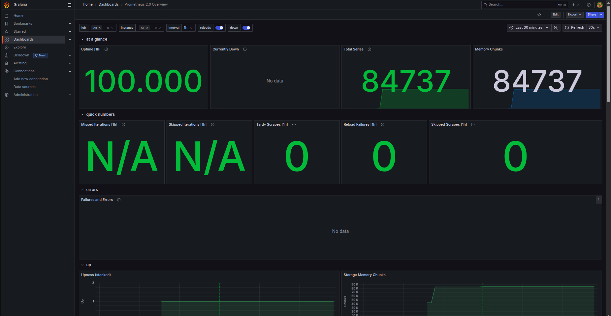
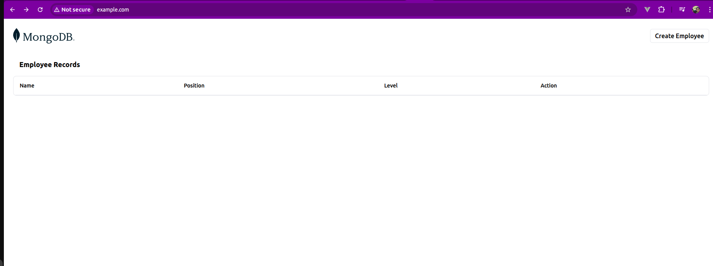
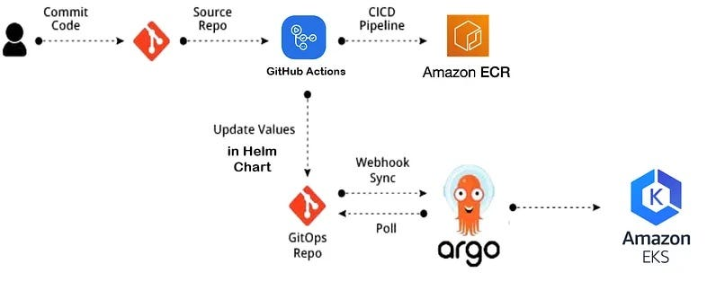

# 🚀 DevOps Engineer Task – MERN Stack on AWS EKS with CI/CD, Monitoring & IaC

This repository showcases a full end-to-end DevOps pipeline for deploying a containerized **MERN stack application** on **AWS EKS** using best practices in CI/CD, Infrastructure as Code, Monitoring, and GitOps.

---

## 📌 Features Implemented

- 🐳 **Dockerized MERN Stack** (Frontend + Backend + MongoDB)
- ⚙️ **Infrastructure as Code** using Terraform (modular setup)
- ☸️ **Kubernetes manifests** for production-ready deployment
- 🔄 **CI/CD pipeline** using GitHub Actions + Argo CD
- 📈 **Monitoring stack** with Prometheus + Grafana
- 🌐 **Ingress setup** using AWS ALB Controller
- 🔐 IAM + OIDC + Secrets managed securely

---

## 📂 Project Structure

```bash
.
├── Terraform/
│   ├── modules/
│   │   ├── vpc/
│   │   ├── eks/
│   │   ├── ecr/
│   ├── main.tf
│   ├── variables.tf
│   └── output.tf
│
├── Kubernetes/
│   ├── manifests/
│      ├── frontend/
│      ├── backend/
│      ├── database/
│      └── ingress/
│
│
├── mern-stack/
│   ├── frontend/
│   │   ├── Dockerfile
│   │   └── .github/
│   │       └── workflows/
│   │           └── ci-cd.yaml  # GitHub Actions workflow added here for demo purpose
│   └── backend/
│       ├── Dockerfile
│
├── docker-compose.yaml
│
├── Screenshots/
│   ├── grafana-dashboard.png
│   ├── argo-cd-ui.png
│   ├── prometheus-query.png
│   └── mern-ui.png
│
├── Architecture/
│   ├── eks-mern-Architecture.png      # Full EKS setup
│   ├── mern-app-Architecture.png      # Application Architecture
│   └── ci-cd-pipeline.png             # CI/CD workflow diagram 
└── README.md
```

---

## 🛠 Component Walkthrough

### 1. 🐳 MERN Stack Containerization
Dockerized `frontend` and `backend` apps. Local testing supported via `docker-compose.yml`.

📁 Location:  
`mern-stack/frontend/Dockerfile`  
`mern-stack/backend/Dockerfile`  
`docker-compose.yml`

---

### 2. ⚙️ Infrastructure Provisioning (Terraform)
Provisioned using modular Terraform code:
- VPC, Subnets
- EKS Cluster and Worker Nodes
- ECR for Docker image storage

📁 Location:  
`terraform/`  
`terraform/modules/`

---

### 3. ☸️ Kubernetes Manifests
Includes deployments and services for:
- MongoDB (as StatefulSet)
- Backend and Frontend
- Ingress configured for ALB

📁 Location:  
`Kubernetes/manifests/`  

---

### 4. 🔄 CI/CD Pipeline
- GitHub Actions configured to build and push Docker images to AWS ECR
- Argo CD automatically deploys latest changes from Git to the EKS cluster

📁 Location:  
`mern-stack/frontend/.github/workflows/ci-cd.yaml`

---

### 5. 📈 Monitoring Stack (Prometheus + Grafana)
- Deployed using Helm
- Prometheus scrapes Kubernetes metrics
- Grafana used for dashboarding

📁 Screenshot:  
`Screenshots/grafana-dashboard.png`

---

### 6. 🌐 ALB Ingress Controller
- Installed using Helm
- Configured to expose frontend/backend using HTTPS

---

### 7. 📎 Demo Preview (Screenshots)

| Argo CD UI | Grafana Dashboard |
|------------|-------------------|
|  |  |

| MERN App (Frontend via ALB) |
|-----------------------------|
|  |

---

## 🗺️ Architecture Diagrams

### 1. 📊 Infrastructure Setup


### 2. 📦 Application Architecture


### 3. 🔄 CI/CD Workflow


---

## 🧾 Walkthrough Summary

This repository includes everything requested in the task:
- Dockerized MERN stack app with MongoDB
- EKS cluster with ALB ingress and HTTPS
- CI/CD using GitHub Actions + Argo CD
- Monitoring with Prometheus + Grafana
- Infra provisioned via modular Terraform

Please refer to the Screenshots and diagrams for proof of concept.

---

## 📬 Notes

- Replace dummy paths with actual ones if necessary.
- Ensure you have AWS credentials, `kubectl`, `eksctl`, `terraform`, and `argocd` CLI set up locally.
- Secrets should be managed securely using AWS SSM or Kubernetes secrets.

---

## 📧 Contact

For any queries regarding this setup, feel free to connect with me.
- Email : aswinikailas1@gmail.com
- Phone : +971 589388067